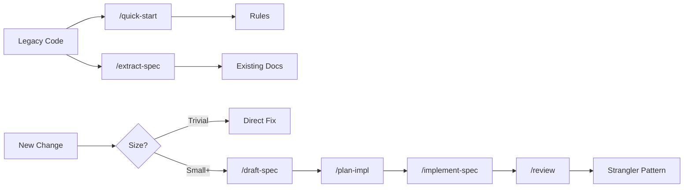

# Brownfield Workflow

Work with existing codebases using the spec-driven approach.

## Overview



## Phase 1: Understand the Codebase

### 1. Initialize with quick-start

```
/quick-start
```

This will:
- Detect your tech stack
- Configure build/test/lint commands
- Set up initial rules
- Identify patterns in existing code

### 2. Extract specs from existing code

Start with the most important modules:

```
/extract-spec src/auth/
```

```
/extract-spec "payment processing"
```

The agent will:
- Search for relevant code
- Analyze behavior and interfaces
- Generate documentation specs
- Identify dependencies

**Output**: `docs/specs/{module}-existing.md`

### 3. Review and refine

Extracted specs are a starting point. Review and correct:
- Missing behavior
- Incorrect assumptions
- Undocumented edge cases
- Implicit dependencies

## Phase 2: Establish Standards

### 1. Update rules

Based on what you learned, update `.cursor/rules/project.mdc`:
- Coding conventions from existing code
- Architectural patterns
- Domain-specific terminology
- Things to preserve vs change

### 2. Create templates

If the project lacks consistent patterns, create templates:
- Copy `.cursor/templates/*.rule.md` to `.cursor/rules/`
- Customize for your project
- Reference in `/quick-start` output

## Phase 3: Make Changes (Strangler Pattern)

For each new change or refactor:

### 1. Assess the change size

See [Problem Size Guide](problem-size-guide.md):

| Size | Approach |
|------|----------|
| Trivial | Direct fix, no spec needed |
| Small | Spec → Implement |
| Medium+ | Spec → Plan → Implement → Review |

### 2. Write a spec for the change

Even for refactors, write a spec:

```
/draft-spec "Refactor payment service to use async/await"
```

The spec defines:
- What changes
- What stays the same
- Success criteria

### 3. Plan carefully

For brownfield changes, planning is critical:

```
/plan-impl docs/specs/refactor-payment-service.md
```

The plan identifies:
- Files that will change
- Dependencies that might break
- Tests that need updating
- Rollback strategy

### 4. Implement incrementally

```
/implement-spec docs/specs/refactor-payment-service.md
```

The agent will:
- Make changes following the plan
- Preserve existing behavior
- Update tests
- Verify nothing breaks

### 5. Verify thoroughly

```
/review --spec docs/specs/refactor-payment-service.md
```

Plus:
- Run full test suite
- Manual testing of affected features
- Check for regressions

## Strangler Pattern

Over time, spec-driven changes "strangle" legacy code:

```
Before:
[Legacy Code] ← all changes

After:
[Legacy Code] ← shrinking
[Spec-Driven Code] ← growing

Eventually:
[Spec-Driven Code] ← all new development
[Legacy (minimal)] ← only maintenance
```

## Tips for Brownfield

### Don't boil the ocean
- Extract specs incrementally, not all at once
- Focus on code you're about to change
- Document as you go

### Preserve before changing
- Extract spec from existing code first
- Verify your understanding
- Then write spec for the change

### Keep rules up to date
- Add rules when you discover patterns
- Remove rules when patterns change
- Rules reflect reality, not aspirations

### Use tests as specs
If tests exist, they document behavior:
```
/extract-spec tests/payment.test.ts
```

### Handle missing tests
If tests are missing:
1. Extract spec from code
2. Write tests to match spec
3. Then make changes

## Example

### Scenario
Legacy API endpoint needs pagination added.

### Step 1: Extract existing spec
```
/extract-spec src/api/users.ts
```

**Output**: Documents current behavior (returns all users, no pagination)

### Step 2: Write change spec
```
/draft-spec "Add pagination to GET /api/users endpoint"
```

**Output**: Spec with:
- Query params: `page`, `limit`
- Response: `{ data: [], meta: { page, total } }`
- Backward compatibility: default to page 1, limit 20

### Step 3: Plan and implement
```
/plan-impl docs/specs/users-pagination.md
/implement-spec docs/specs/users-pagination.md
```

### Step 4: Review
```
/review --spec docs/specs/users-pagination.md
```

Verify:
- [ ] Existing tests pass
- [ ] New pagination tests pass
- [ ] Old clients still work (defaults)
