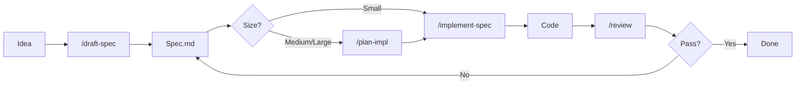

# Greenfield Workflow

Build new features from scratch using the spec-driven approach.

## Overview



## Step-by-Step

### 1. Start with an idea

Begin with a clear description of what you want to build:
- What problem does it solve?
- Who is the user?
- What's the expected behavior?

### 2. Generate a spec

```
/draft-spec "Add user authentication with email/password login"
```

The agent will:
- Ask clarifying questions if needed
- Search for related patterns in your codebase
- Generate a structured spec in `docs/specs/`

**Output**: `docs/specs/user-authentication.md`

### 3. Review and refine the spec

Open the generated spec and verify:
- [ ] Requirements are complete
- [ ] Constraints are accurate
- [ ] Scope is appropriate
- [ ] Nothing is missing

Edit the spec directly if needed.

### 4. Create an implementation plan (medium/large features)

```
/plan-impl docs/specs/user-authentication.md
```

The agent will:
- Break down the spec into concrete steps
- Identify files to create/modify
- Plan tests to write
- Flag potential risks

**Output**: `.cursor/plans/user-authentication.plan.md`

Review the plan and adjust if needed.

### 5. Implement

```
/implement-spec docs/specs/user-authentication.md
```

Or from the plan:
```
/implement-spec .cursor/plans/user-authentication.plan.md
```

The agent will:
- Follow the spec/plan step by step
- Create and modify files
- Write tests
- Run tests and linters
- Fix issues automatically

### 6. Review

```
/review --spec docs/specs/user-authentication.md
```

The agent will:
- Check code against the spec
- Verify all requirements are met
- Flag any issues
- Suggest improvements

### 7. Iterate or complete

If issues are found:
1. Update the spec with clarifications
2. Re-run `/implement-spec`
3. Re-run `/review`

If everything passes:
1. Manually test the feature
2. Archive the spec (optional)
3. Commit the changes

## When to Skip Steps

See [Problem Size Guide](problem-size-guide.md) for guidance on when to use the full workflow vs shortcuts.

| Size | Skip Plan? | Skip Spec? |
|------|------------|------------|
| Trivial (typo, 1-line) | Yes | Yes |
| Small (single file) | Yes | No |
| Medium (multi-file) | No | No |
| Large (epic) | No | No |

## Tips

- **Keep specs small**: One feature per spec
- **Be specific**: Vague specs produce vague code
- **Include examples**: Show expected inputs/outputs
- **Iterate quickly**: It's faster to refine a spec than debug code
- **Trust but verify**: Review AI-generated code carefully

## Example

### Idea
"Add a search feature to find users by name or email"

### Spec (generated)
```markdown
# User Search

## Requirements
- [ ] Search users by name (partial match)
- [ ] Search users by email (exact match)
- [ ] Return paginated results (20 per page)
- [ ] Handle empty results gracefully

## Acceptance Criteria
- Given a search term "john", return all users with "john" in name
- Given an email "john@example.com", return exact match
```

### Plan (generated)
1. Create `UserSearchService` with search methods
2. Add `GET /api/users/search` endpoint
3. Create search input component
4. Add pagination to results
5. Write tests for search logic

### Result
Working search feature matching the spec.
